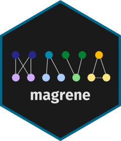
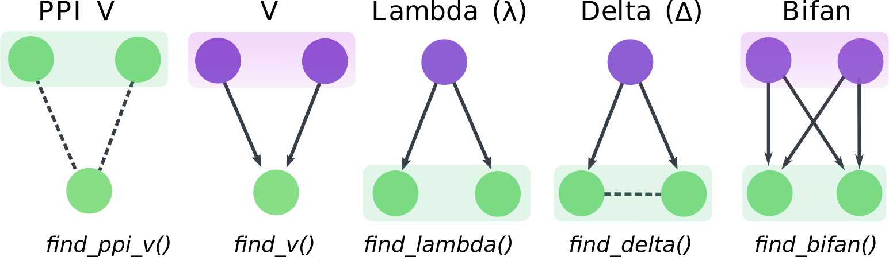

<!-- README.md is generated from README.Rmd. Please edit that file -->

```{r, include = FALSE}
knitr::opts_chunk$set(
    collapse = TRUE,
    comment = "#>",
    fig.path = "man/figures/README-",
    out.width = "100%"
)
```

# magrene 

<!-- badges: start -->
[](https://github.com/almeidasilvaf/magrene/issues)
[](https://lifecycle.r-lib.org/articles/stages.html#stable)
[](https://github.com/almeidasilvaf/magrene/actions)
[](https://codecov.io/gh/almeidasilvaf/magrene?branch=master)
<!-- badges: end -->

The goal of `magrene` is to identify and analyze graph motifs containing 
duplicated genes in gene regulatory networks (GRNs). Possible motifs include 
V, PPI V, lambda, delta, and bifans.

Motif frequencies can be analyzed in the context of gene duplications 
to explore the impact of small-scale and whole-genome duplications 
on gene regulatory networks.

Additionally, GRNs can be tested for motif enrichment by comparing 
motif frequencies to a null distribution generated from 
degree-preserving simulated GRNs. 

Finally, users can calculate the interaction similarity between gene pairs
based on the Sorensen-Dice similarity index.

```{r include_figure, echo = FALSE, fig.cap = "Network motifs and functions to identify them. Shaded boxes indicate paralogs. Regulators and targets are indicated in purple and green, respectively. Arrows indicate directed regulatory interactions, while dashed lines indicate protein-protein interaction."}

```


## Installation instructions

Get the latest stable `R` release from [CRAN](http://cran.r-project.org/). Then install `magrene` using from [Bioconductor](http://bioconductor.org/) the following code:

```{r 'install', eval = FALSE}
if (!requireNamespace("BiocManager", quietly = TRUE)) {
    install.packages("BiocManager")
}

BiocManager::install("magrene")
```

And the development version from [GitHub](https://github.com/almeidasilvaf/magrene) with:

```{r 'install_dev', eval = FALSE}
BiocManager::install("almeidasilvaf/magrene")
```

## Citation

Below is the citation output from using `citation('magrene')` in R. Please
run this yourself to check for any updates on how to cite __magrene__.

```{r 'citation', eval = requireNamespace('magrene')}
print(citation('magrene'), bibtex = TRUE)
```

Please note that `magrene` was only made possible thanks to many other R and bioinformatics software authors, which are cited either in the vignettes and/or the paper(s) describing this package.

## Code of Conduct

Please note that the `magrene` project is released with a [Contributor Code of Conduct](http://bioconductor.org/about/code-of-conduct/). By contributing to this project, you agree to abide by its terms.

## Development tools

* Continuous code testing is possible thanks to [GitHub actions](https://www.tidyverse.org/blog/2020/04/usethis-1-6-0/)  through `r BiocStyle::CRANpkg('usethis')`, `r BiocStyle::CRANpkg('remotes')`, and `r BiocStyle::CRANpkg('rcmdcheck')` customized to use [Bioconductor's docker containers](https://www.bioconductor.org/help/docker/) and `r BiocStyle::Biocpkg('BiocCheck')`.
* Code coverage assessment is possible thanks to [codecov](https://codecov.io/gh) and `r BiocStyle::CRANpkg('covr')`.
* The [documentation website](http://almeidasilvaf.github.io/magrene) is automatically updated thanks to `r BiocStyle::CRANpkg('pkgdown')`.
* The documentation is formatted thanks to `r BiocStyle::CRANpkg('devtools')` and `r BiocStyle::CRANpkg('roxygen2')`.

For more details, check the `dev` directory.

This package was developed using `r BiocStyle::Biocpkg('biocthis')`.
